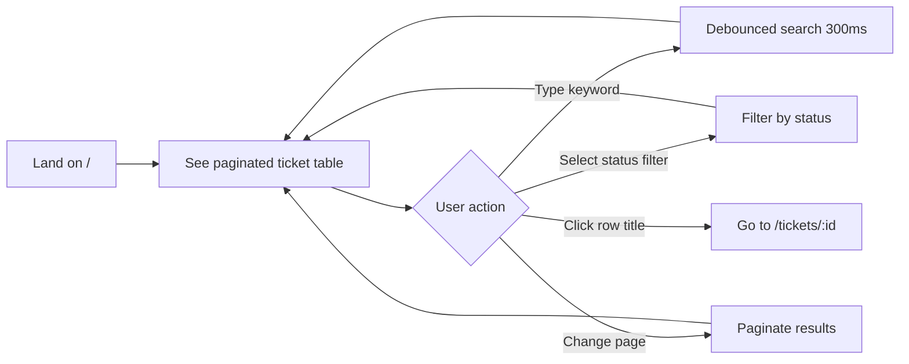
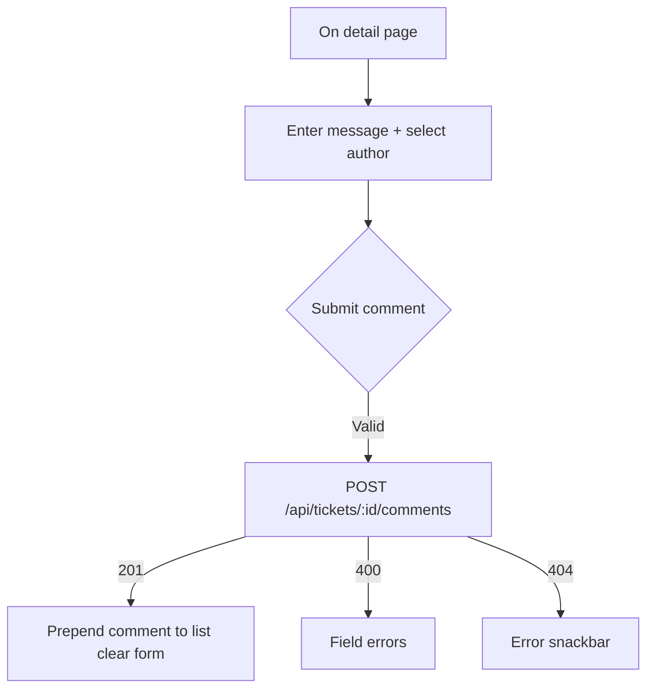

# UI Flow

User journeys and screen interactions for the React frontend (`localhost:5173`).

## Application shell

All pages render inside `MainLayout`:

- **App bar** — title and **New Ticket** link (`/tickets/new`)
- **Content area** — current page
- **Snackbar** — success/error toasts (bottom-right)

---

## Route map

| Path | Page | Purpose |
|------|------|---------|
| `/` | `TicketListPage` | Browse, search, and filter tickets |
| `/tickets/new` | `CreateTicketPage` | Create a new ticket |
| `/tickets/:id` | `TicketDetailPage` | View ticket, change status, add comments |
| `/tickets/:id/edit` | `EditTicketPage` | Edit title, description, priority, assignee |

---

## Primary user flows

### 1. Browse and find tickets



**List page behavior:**

- Keyword search matches title and description (case-insensitive, server-side).
- Status filter: All, OPEN, IN_PROGRESS, RESOLVED, CLOSED, CANCELLED.
- Results sorted by `updatedAt` descending.
- Page size: 10 tickets per page.
- Loading spinner while fetching; error snackbar on API failure.

---

### 2. Create a ticket

```mermaid
flowchart TD
    A[Click New Ticket in nav] --> B[/tickets/new]
    B --> C[Fill form]
    C --> D{Submit}
    D -->|Valid| E[POST /api/tickets]
    E -->|201| F[Redirect to /tickets/:id]
    E -->|400| G[Show field errors inline]
    E -->|404/500| H[Show error snackbar]
    D -->|Client validation fails| G
```

**Form fields:**

| Field | Control | Required |
|-------|---------|----------|
| Title | Text input | Yes (max 200 chars) |
| Description | Multiline text | Yes |
| Priority | Dropdown | Yes (LOW / MEDIUM / HIGH / CRITICAL) |
| Assigned to | User dropdown | Yes |
| Created by | User dropdown | Yes |

**On success:** Server sets status to `OPEN`; user lands on the detail page.

---

### 3. View ticket and change status

```mermaid
flowchart TD
    A[/tickets/:id] --> B[Load ticket + comments + users in parallel]
    B --> C[Display metadata and status chip]
    C --> D{allowedNextStatuses}
    D -->|Has values| E[Render one button per status]
    D -->|Empty| F[No status buttons terminal state]
    E --> G[User clicks status button]
    G --> H[PATCH /api/tickets/:id/status]
    H -->|200| I[Refresh ticket state buttons update]
    H -->|400| J[Error snackbar invalid transition]
```

**Critical design rule:** Status buttons are rendered **only** from `ticket.allowedNextStatuses` returned by the API. The frontend does not hard-code transition logic.

**Detail page sections:**

1. Header — title, status chip, priority chip, Back button
2. Metadata — assignee, creator, created/updated timestamps
3. Description
4. Status actions — dynamic buttons from API
5. Edit link — navigates to `/tickets/:id/edit`
6. Comments — list (newest first) + add comment form

---

### 4. Edit ticket metadata

```mermaid
flowchart TD
    A[Click Edit on detail page] --> B[/tickets/:id/edit]
    B --> C[Pre-filled form title description priority assignee]
    C --> D{Submit}
    D -->|Valid| E[PUT /api/tickets/:id]
    E -->|200| F[Redirect to /tickets/:id]
    E -->|400| G[Field errors]
    E -->|404| H[Error snackbar]
```

**Note:** Status cannot be changed on the edit page. Status transitions use the dedicated PATCH endpoint on the detail page.

---

### 5. Add a comment



---

## Navigation diagram

```
                    ┌─────────────────┐
                    │  TicketListPage │
                    │       /         │
                    └────────┬────────┘
              ┌──────────────┼──────────────┐
              │              │              │
              ▼              ▼              ▼
    ┌─────────────┐  ┌──────────────┐  ┌─────────────┐
    │CreateTicket │  │TicketDetail  │  │  (nav bar)  │
    │/tickets/new │  │/tickets/:id  │  │ New Ticket  │
    └──────┬──────┘  └──────┬───────┘  └─────────────┘
           │                │
           │         ┌──────┴──────┐
           │         │             │
           │         ▼             ▼
           │  ┌─────────────┐  Back to /
           │  │ EditTicket  │
           │  │/tickets/:id │
           │  │    /edit    │
           │  └──────┬──────┘
           │         │
           └─────────┴──► TicketDetailPage (after create/edit)
```

---

## Error and feedback patterns

| Scenario | UX behavior |
|----------|-------------|
| Validation error (400) | Inline field errors on forms; snackbar for non-field errors |
| Invalid status transition (400) | Error snackbar with server message |
| Not found (404) | Error snackbar |
| Backend not running | `"Unable to reach server"` snackbar |
| Successful create/update/status/comment | Success snackbar |

**Utilities:** `errorUtils.ts` (`getErrorMessage`, `getFieldErrors`), `validationUtils.ts` (client-side pre-checks).

---

## Status display (UI only)

`statusUtils.ts` provides labels and chip colors — display helpers only, not business rules:

| Status | Chip color (approx.) |
|--------|----------------------|
| OPEN | Default / blue |
| IN_PROGRESS | Warning / orange |
| RESOLVED | Info |
| CLOSED | Success / green |
| CANCELLED | Error / red |

Priority chips use `getPriorityColor` (LOW → CRITICAL escalates visually).

---

## API dependencies per page

| Page | API calls |
|------|-----------|
| List | `GET /api/tickets` |
| Create | `GET /api/users`, `POST /api/tickets` |
| Detail | `GET /api/tickets/:id`, `GET /api/tickets/:id/comments`, `GET /api/users`, `PATCH /api/tickets/:id/status`, `POST /api/tickets/:id/comments` |
| Edit | `GET /api/tickets/:id`, `GET /api/users`, `PUT /api/tickets/:id` |

---

## Manual test checklist

1. List loads with seed tickets; search and filter work.
2. Create ticket → lands on detail with status `OPEN`.
3. Only valid status buttons appear at each stage of the lifecycle.
4. Invalid transitions are impossible from the UI (buttons not shown).
5. Edit updates metadata without changing status.
6. Comments appear newest first; new comment prepends on success.
7. Stop backend → pages show network error snackbar.
